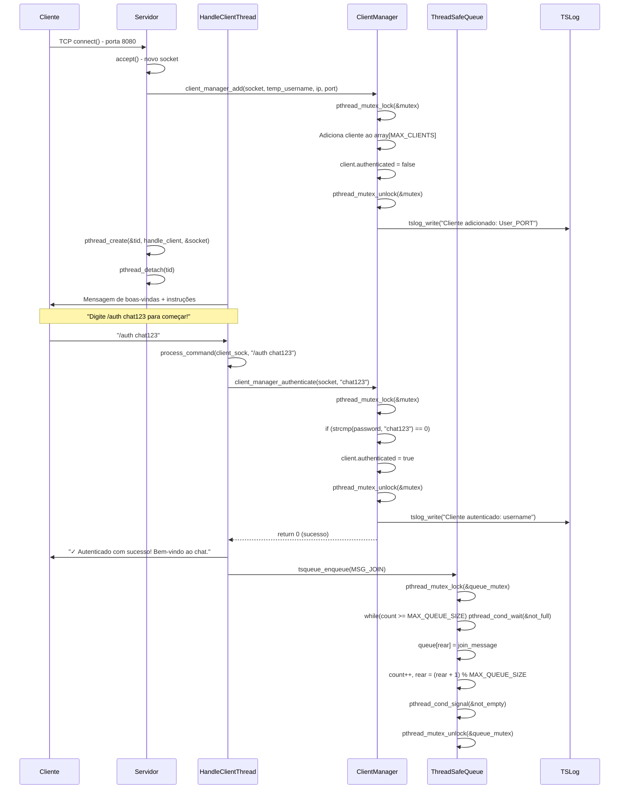
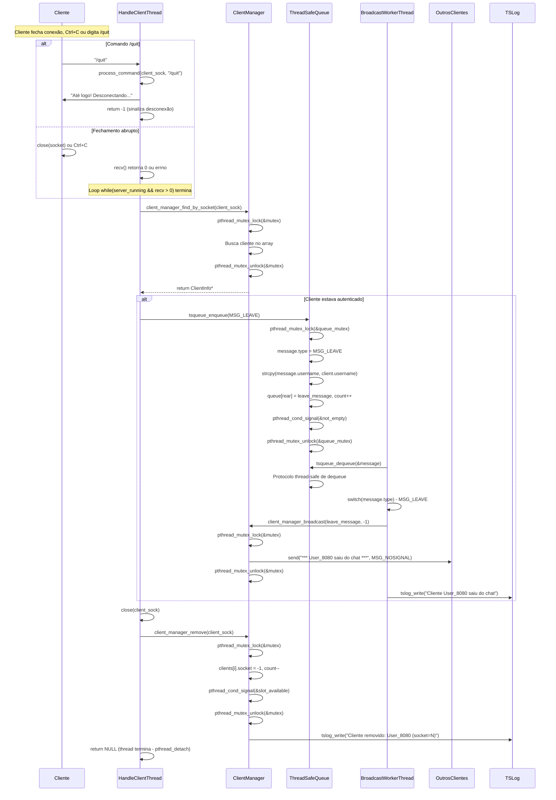
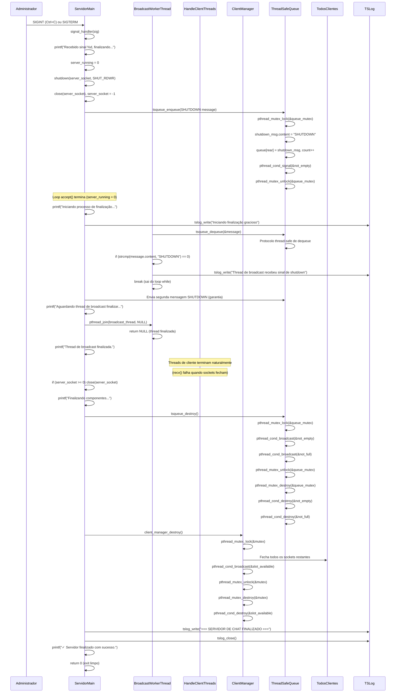
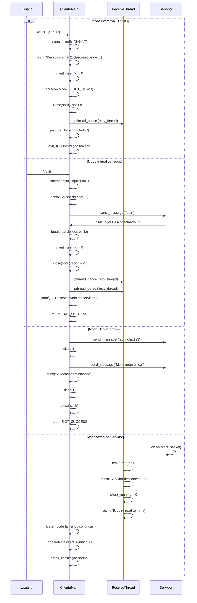

# Diagramas de Sequência - Chat Multiusuário v3

## 1. Conexão de Cliente e Autenticação



## 2. Broadcast de Mensagem

```mermaid
sequenceDiagram
    participant C1 as Cliente1
    participant HT as HandleClientThread
    participant Q as ThreadSafeQueue
    participant BW as BroadcastWorkerThread
    participant CM as ClientManager
    participant C2 as Cliente2
    participant C3 as Cliente3
    participant L as TSLog

    C1->>HT: "Olá pessoal!"
    HT->>HT: recv(client_sock, buffer, BUFFER_SIZE)
    
    alt Cliente não autenticado
        HT->>C1: "⚠ Você precisa se autenticar: /auth <senha>"
        HT->>L: tslog_write("Mensagem rejeitada (não autenticado)")
    else Cliente autenticado
        HT->>HT: contains_profanity(buffer) - verifica lista
        
        alt Contém palavrão
            HT->>C1: "⚠ AVISO: Mensagem contém conteúdo proibido"
            HT->>L: tslog_write("Mensagem bloqueada por filtro")
        else Mensagem limpa
            HT->>HT: snprintf("[%s]: %s", username, buffer)
            HT->>Q: tsqueue_enqueue(MSG_BROADCAST, formatted_msg)
            Q->>Q: pthread_mutex_lock(&queue_mutex)
            Q->>Q: while(count >= MAX_QUEUE_SIZE) pthread_cond_wait(&not_full)
            Q->>Q: queue[rear] = broadcast_message
            Q->>Q: count++, rear++
            Q->>Q: pthread_cond_signal(&not_empty)
            Q->>Q: pthread_mutex_unlock(&queue_mutex)
            
            HT->>HT: printf("[Chat] %s", formatted_msg)
        end
    end
    
    BW->>Q: tsqueue_dequeue(&message)
    Q->>Q: pthread_mutex_lock(&queue_mutex)
    Q->>Q: while(count == 0) pthread_cond_wait(&not_empty)
    Q->>Q: message = queue[front]
    Q->>Q: count--, front++
    Q->>Q: pthread_cond_signal(&not_full)
    Q->>Q: pthread_mutex_unlock(&queue_mutex)
    
    BW->>BW: switch(message.type) - MSG_BROADCAST
    BW->>CM: client_manager_broadcast(message.content, sender_fd)
    CM->>CM: pthread_mutex_lock(&mutex)
    CM->>CM: for(i=0; i<MAX_CLIENTS; i++)
    CM->>C2: send("[Cliente1]: Olá pessoal!", MSG_NOSIGNAL)
    CM->>C3: send("[Cliente1]: Olá pessoal!", MSG_NOSIGNAL)
    CM->>CM: pthread_mutex_unlock(&mutex)
    CM-->>BW: return sent_count
    
    BW->>L: tslog_write("Broadcast de Cliente1 para 2 clientes: [Cliente1]: Olá pessoal!")
```

## 3. Mensagem Privada

```mermaid
sequenceDiagram
    participant C1 as Cliente1
    participant HT as HandleClientThread
    participant CM as ClientManager
    participant Q as ThreadSafeQueue
    participant BW as BroadcastWorkerThread
    participant C2 as Cliente2
    participant L as TSLog

    C1->>HT: "/msg User_8080 Olá privado!"
    HT->>HT: process_command(client_sock, "/msg User_8080 Olá privado!")
    HT->>HT: strncmp(command, "/msg ", 5) == 0
    HT->>HT: Parse: target="User_8080", message="Olá privado!"
    
    HT->>CM: client_manager_find_by_username("User_8080")
    CM->>CM: pthread_mutex_lock(&mutex)
    CM->>CM: for(i=0; i<MAX_CLIENTS; i++) strcmp(username)
    CM->>CM: pthread_mutex_unlock(&mutex)
    CM-->>HT: return ClientInfo* ou NULL
    
    alt Cliente encontrado e online
        HT->>Q: tsqueue_enqueue(MSG_PRIVATE)
        Q->>Q: pthread_mutex_lock(&queue_mutex)
        Q->>Q: message.type = MSG_PRIVATE
        Q->>Q: strcpy(message.username, "Cliente1")
        Q->>Q: strcpy(message.target, "User_8080")
        Q->>Q: strcpy(message.content, "Olá privado!")
        Q->>Q: queue[rear] = message, count++
        Q->>Q: pthread_cond_signal(&not_empty)
        Q->>Q: pthread_mutex_unlock(&queue_mutex)
        
        BW->>Q: tsqueue_dequeue(&message)
        Q->>Q: Protocolo thread-safe de dequeue
        
        BW->>BW: switch(message.type) - MSG_PRIVATE
        BW->>CM: client_manager_send_private(username, target, content)
        CM->>CM: pthread_mutex_lock(&mutex)
        CM->>CM: Encontra socket do target_user
        CM->>C2: send("[PRIVADA de Cliente1]: Olá privado!", MSG_NOSIGNAL)
        CM->>CM: pthread_mutex_unlock(&mutex)
        
        BW->>L: tslog_write("Mensagem privada: Cliente1 -> User_8080")
        HT->>C1: "✓ Mensagem privada enviada para User_8080"
        
    else Cliente não encontrado ou offline
        HT->>C1: "✗ Usuário 'User_8080' não encontrado ou offline"
        HT->>L: tslog_write("Tentativa de mensagem privada para usuário inexistente")
    end
```

## 4. Desconexão de Cliente



## 5. Finalização Gracioso do Servidor



## 6. Finalização do Cliente



## Sincronização e Proteção

### Componentes Thread-Safe Implementados:

1. **ThreadSafeQueue (Monitor Pattern)**:
   - **Mutex**: `pthread_mutex_t queue_mutex`
   - **Condition Variables**: 
     - `pthread_cond_t not_empty` - Sinaliza quando há mensagens
     - `pthread_cond_t not_full` - Sinaliza quando há espaço
   - **Operações Atômicas**: 
     - `tsqueue_enqueue()` - Producer bloqueia se fila cheia
     - `tsqueue_dequeue()` - Consumer bloqueia se fila vazia
   - **Capacidade**: `MAX_QUEUE_SIZE` (100 mensagens)

2. **ClientManager (Reader-Writer Pattern)**:
   - **Mutex**: `pthread_mutex_t mutex`
   - **Condition Variable**: `pthread_cond_t slot_available`
   - **Operações Protegidas**:
     - `client_manager_add()` - Adiciona cliente thread-safe
     - `client_manager_remove()` - Remove cliente thread-safe
     - `client_manager_broadcast()` - Envia para todos os clientes
     - `client_manager_authenticate()` - Atualiza status de autenticação
     - `client_manager_find_by_*()` - Busca thread-safe
   - **Capacidade**: `MAX_CLIENTS` (10 clientes simultâneos)

3. **TSLog (Synchronized Logging)**:
   - **Mutex**: `pthread_mutex_t mutex_log`
   - **Operações**:
     - `tslog_write()` - Escrita thread-safe com timestamp
     - `tslog_init()` / `tslog_close()` - Gerenciamento seguro do arquivo
   - **Formato**: `[YYYY-MM-DD HH:MM:SS] mensagem`

### Padrões de Concorrência Aplicados:

1. **Producer-Consumer**: 
   - **Produtores**: HandleClientThreads (N threads)
   - **Consumidor**: BroadcastWorkerThread (1 thread)
   - **Buffer**: ThreadSafeQueue com sincronização via condition variables

2. **Thread Pool Dinâmico**:
   - **Threads criadas sob demanda**: `pthread_create()` para cada cliente
   - **Cleanup automático**: `pthread_detach()` para threads de cliente
   - **Thread persistente**: BroadcastWorker roda durante toda vida do servidor

3. **Monitor Pattern**:
   - **ThreadSafeQueue**: Encapsula toda lógica de sincronização internamente
   - **ClientManager**: Protege estruturas de dados compartilhadas
   - **Invariantes preservadas**: Nunca há condições de corrida

4. **Graceful Shutdown**:
   - **Servidor**: Sinal especial "SHUTDOWN" na fila para finalizar BroadcastWorker
   - **Cliente**: `exit(0)` forçado no signal handler para evitar deadlock
   - **Cleanup**: Todos os mutexes e condition variables são devidamente destruídos

### Tratamento de Condições de Corrida:

- ✅ **Lista de clientes**: Protegida por mutex em todas as operações
- ✅ **Fila de mensagens**: Implementa protocolo wait/signal correto
- ✅ **Logs**: Escritas serializadas com timestamp thread-safe  
- ✅ **Autenticação**: Status protegido contra modificação concorrente
- ✅ **Sockets**: Fechamento thread-safe com `shutdown()` antes de `close()`
- ✅ **Contadores**: Atualizados atomicamente dentro de seções críticas